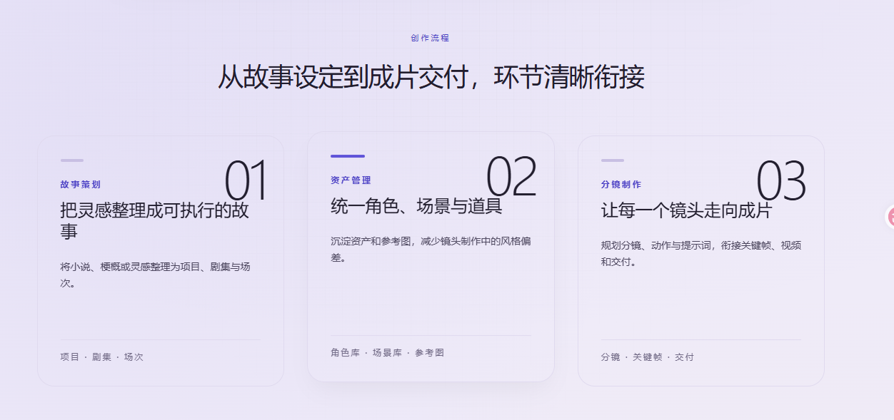
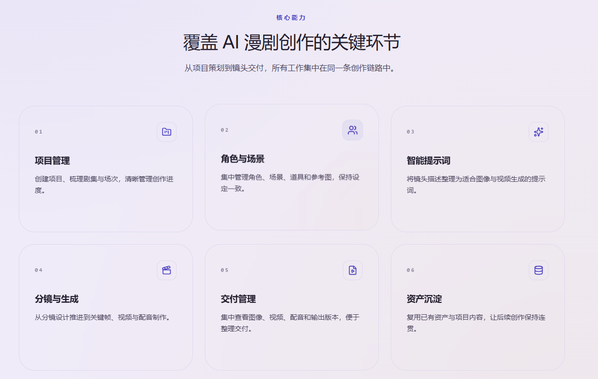
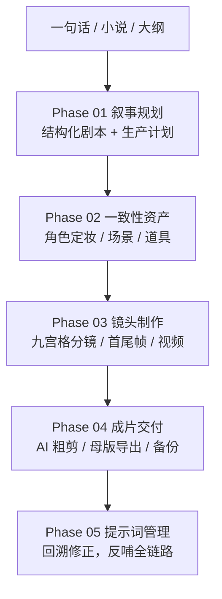

<h1 align="center">🎬 拾光演绎 AI Time</h1>

<p align="center">
  <strong>AI 一站式短剧 / 漫剧生成平台 · 从剧本到成片的工业化工作台</strong>
  <br>
  <em>AI Motion Comic &amp; Short Drama Workbench</em>
</p>

<p align="center">
  <a href="platform/LICENSE"></a>
  <a href="https://github.com/fuhanhao/AI-Time/stargazers"></a>
  <a href="#快速开始"></a>
</p>

**拾光演绎（AI Time）** 是一套面向短剧与漫剧创作者的 AI 制作平台：输入一句话、一段大纲或整篇小说，即可沿着「剧本 → 资产 → 关键帧 → 成片」的工业化流程完成制作。它用关键帧驱动取代"抽卡式"生成，让角色一致性、场景连续性和镜头运动都可控、可复现、可修改。

---

## 界面展示





---

## 它能帮你完成什么

| 阶段 | 解决的问题 | 产出物 |
|------|-----------|--------|
| 📝 叙事规划 | 从小说 / 大纲到结构化剧本，自动拆解角色、场景、道具、镜头 | 剧本 + 生产计划 |
| 🧑‍🎨 一致性资产 | 角色定妆、场景与道具资产化，从源头杜绝"变脸" | 定妆照、场景图、道具参考 |
| 🎞️ 镜头制作 | 九宫格分镜、首尾帧精控、上下文感知生成 | 分镜、关键帧、视频片段 |
| ✂️ 成片交付 | 时间线预览、AI 粗剪、多格式导出 | 母版视频、素材包、备份 |
| 🔎 提示词管理 | 集中检索、版本回滚、跨阶段定位修正 | 可追溯的提示词库 |

---

## 传统生成方式的问题

| 痛点 | 传统做法 | 拾光演绎的做法 |
|------|---------|---------------|
| 🎭 角色不一致 | 每次生成都"随缘"，角色频繁变脸 | Phase 02 定妆 + 资产约束，全程引用参考图 |
| 🏠 场景不连戏 | 场景图各自独立，前后对不上 | 场景资产化，镜头生成自动带入上下文 |
| 🎥 运镜不可控 | 模型自由发挥，无法指定起止画面 | 首尾帧关键帧插值，先画后动 |
| 🔁 修改成本高 | 改一处设定，所有镜头重做 | 资产与提示词可复用，单镜头可单独重做 |
| 📦 流程不沉淀 | 产出物一次性，用完即弃 | 剧本、资产、关键帧、提示词全部落库 |

---

## 从一句话开始

拾光演绎内置了漫剧制作 Agent，你只需要描述需求：

```
"把这部小说做成 24 集古风漫剧，每集 3 分钟，主角形象全程一致"
```

Agent 会自动执行 **镜头表 → 视觉丰富化 → 关键帧 → 参考图 → 视频 → 九宫格 → 配音** 的完整流水线，直接调用编辑剧本、镜头、资产等工具落地修改，而不是只给建议。

---

## 核心功能

### 项目级工作流 (Project Workspace)

* **项目中心 (Project Hub)**：集中管理最近项目、模型配置、全局资产库，以及整库数据导入导出。
* **项目概览 (Project Overview)**：按"项目 → 季 → 集"组织内容，支持整篇小说导入并自动拆分多集草稿，也支持整项目备份导出。
* **项目资源与世界观 (Project Resources & Worldview)**：在单集制作前先沉淀角色 / 场景 / 道具资源，以及地图、区域、地点、音乐风格等世界观锚点，这些信息会持续注入后续剧情、资产和镜头生成。

### Phase 01：叙事规划 (Narrative Planning)

* **结构化剧本生成**：输入故事大纲、小说片段或单集创意，AI 自动拆解出角色、场景、道具、镜头等结构化结果。
* **配置驱动生成**：可设置语言、目标时长、视觉风格和模型组合，统一控制后续全链路输出。
* **AI 续写与手动精修**：支持对剧本正文、角色视觉描述、镜头动作、台词和提示词进行续写、改写与逐项手动编辑。
* **全自动计划预审**：在正式批量生成前，系统会先给出全自动生产方案，允许你逐镜头决定使用"九宫格分镜"还是"首尾帧"链路。

### Phase 02：一致性资产 (Consistency Assets)

* **角色一致性定妆**：为每个角色生成标准参考图，并通过衣橱系统维护多套造型的一致身份。
* **场景 / 道具资产化**：不仅生成核心场景图，也能为可复用道具建立独立提示词、参考图和形体参考。
* **资产库复用**：支持从项目资源或跨项目资产库选择角色、场景、道具，减少重复搭建。
* **批量补齐缺失资产**：可一键补齐角色、场景、道具的缺失图片，为后续镜头制作准备稳定上下文。

### Phase 03：镜头制作 (Shot Workbench)

* **网格化镜头工作台**：全景式管理所有镜头，逐镜头查看叙事动作、角色、场景和道具上下文。
* **关键帧精控**：支持 Start Frame / End Frame 生成、上传、继承与编辑，增强镜头起止状态控制。
* **九宫格分镜预览**：可先生成 9 个候选视角，再选择整图或裁切单格作为首帧，快速确认构图方案。
* **上下文感知生成**：镜头生成时会自动读取当前场景图、角色服装参考和道具参考，显著降低"不连戏"。
* **双视频链路**：既支持单图 Image-to-Video，也支持首尾帧插值生成。

### Phase 04：成片交付 (Delivery Center)

* **时间线预览与渲染追踪**：实时查看镜头完成度、粗剪时间线和渲染日志。
* **AI 粗剪**：内置时间线编辑器，可对已生成镜头做调序、裁剪、滤镜和导出前检查。
* **多种交付方式**：支持导出母版视频、片段压缩包和源素材，便于继续进入 Premiere / Resolve 等后期流程。
* **剧集级备份**：支持当前剧集数据导入导出，便于跨设备迁移与协作。

### Phase 05：提示词管理 (Prompt Management)

* **集中检索与编辑**：统一查看模板、角色、场景、道具、关键帧和视频提示词。
* **版本回滚**：保留提示词编辑历史，可快速回退到旧版本。
* **跨阶段排查**：当结果不稳定时，可以直接回到这一页定位并修正上游提示词问题。

---

## 设计思路：关键帧驱动

传统 Text-to-Video 往往难以控制具体的运镜和起止画面。拾光演绎引入了动画制作中的 **关键帧 (Keyframe)** 概念：

1. **先画后动**：先生成精准的起始帧 (Start) 和结束帧 (End)。
2. **插值生成**：利用视频模型在两帧之间生成平滑的视频过渡。
3. **资产约束**：所有画面生成均受到"角色定妆照"和"场景概念图"的强约束，杜绝人物变形。

整条生产链路 **Script → Asset → Keyframe → Video** 全景如下：



每个阶段的产出物——剧本、资产、关键帧、提示词——都可以单独复用、编辑和回滚，改一处设定不用全部重来。

---

## 快速开始

### 1. 启动工作台

```bash
# 进入主程序目录
cd platform

# 启动服务
docker compose up -d

# 浏览器打开 http://localhost:3005

# 查看日志
docker compose logs -f

# 停止服务
docker compose down
```

### 2. 完成第一条片子

1. **配置模型**：在「模型配置」中填入自己的文本 / 图片 / 语音 / 视频模型 API。
2. **创建项目**：在项目中心新建项目，后续所有季、集、资源和交付结果都会围绕该项目沉淀。
3. **搭建项目框架**：进入项目概览后，手动新建季 / 集，或直接导入整篇小说，让系统自动拆分多集草稿。
4. **补充项目资源**：按需先整理项目角色、场景、道具和世界观，让后续每一集都能复用统一设定。
5. **进入 Phase 01 叙事规划**：生成结构化剧本，并手动校对角色、动作、台词、提示词。
6. **进入 Phase 02 / 03**：先补齐一致性资产，再在镜头制作里生成首帧、尾帧、九宫格分镜和视频片段。
7. **进入 Phase 04 / 05**：在成片交付中预览、粗剪、导出与备份；若需要统一修正生成质量，再回到提示词管理集中调整。

---

## 运行形态

* **部署方式**：通过 Docker 启动完整工作台，浏览器访问即可使用，无需自行编译前端。
* **模型接入**：自由配置文本、图像、视频、语音模型（OpenAI 兼容接口），额度自己掌控。
* **数据保存**：项目数据保存在本地浏览器环境中，适合个人创作与轻量协作。

---

## 常见问题

<details>
<summary><strong>部署需要自己编译前端吗？</strong></summary>

不需要。`cd platform && docker compose up -d` 启动后，浏览器打开 `http://localhost:3005` 即可使用完整工作台。
</details>

<details>
<summary><strong>模型怎么接？必须用某一家吗？</strong></summary>

不绑定任何一家。文本、图像、视频、语音模型都走 OpenAI 兼容接口，在「模型配置」里填上自己的 API 即可，额度自己掌控。
</details>

<details>
<summary><strong>项目数据存在哪里？可以迁移吗？</strong></summary>

数据保存在本地浏览器环境，适合个人创作与轻量协作；支持剧集级备份和整项目导出，可以跨设备迁移。
</details>

<details>
<summary><strong>角色总是变脸怎么办？</strong></summary>

在 Phase 02 先完成角色定妆，生成标准参考图，并通过衣橱系统维护多套造型的一致身份；Phase 03 生成镜头时会自动读取角色服装参考，从源头杜绝"不连戏"。
</details>

<details>
<summary><strong>单个镜头不满意，要全部重来吗？</strong></summary>

不用。可以单独重做单个镜头的首帧 / 尾帧、九宫格或视频片段；也可以回到 Phase 05 提示词管理，定位并修正上游提示词后重新生成。
</details>

---

## 参与贡献

有问题或想法，欢迎提 [Issue](https://github.com/fuhanhao/AI-Time/issues)，也欢迎直接提 [PR](https://github.com/fuhanhao/AI-Time/pulls)。

想本地跑起来？按上面的快速开始启动 Docker 即可；工作台所有数据都在本地，随便折腾。

---

## License

[BigBanana Community License 1.0](platform/LICENSE) · [中文参考译本](platform/LICENSE.zh-CN.md)

*Built for Creators.*
